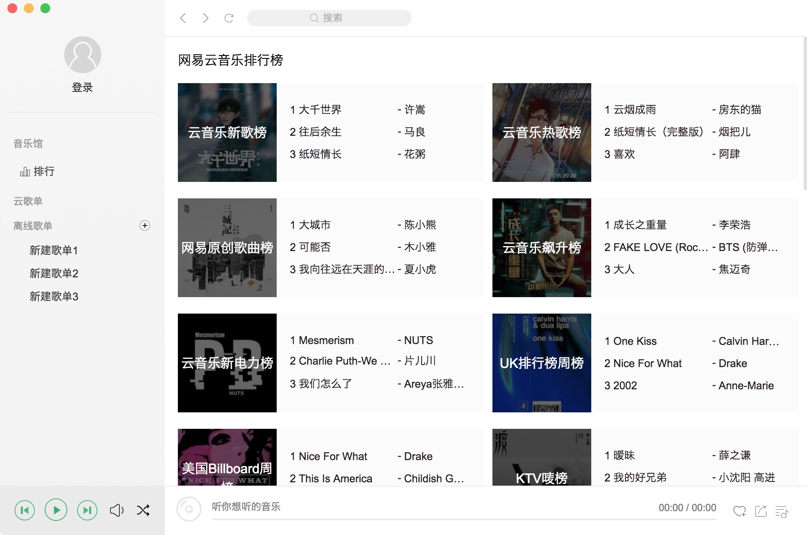
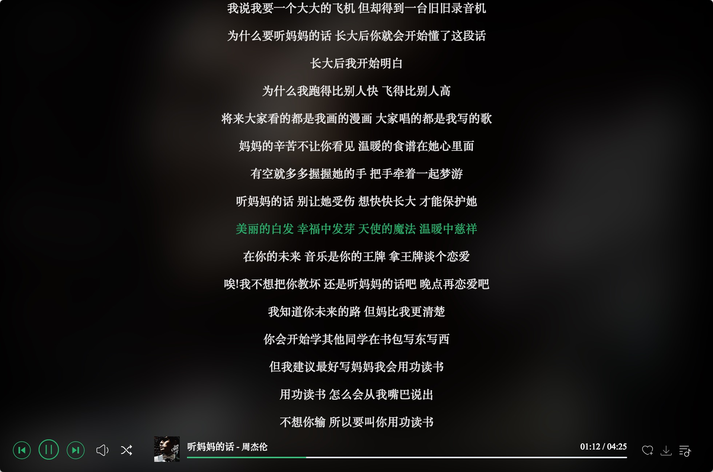

# music player 
- 歌曲[Api](https://github.com/sunzongzheng/musicAPI)涵盖网易云、QQ音乐、虾米
- 界面仿QQ音乐
- Mac > Windows > Linux都会逐步适配，移动端在计划中
# 已完成
- QQ登录
- 云歌单
- 全屏歌词
- 状态栏歌词/播放控制

# 已知Bug
- [ ] 部分网易云歌源只能播放55s
- [ ] 部分歌曲播放几秒后会自动换下一首，但歌曲信息未更新
# 计划
- [ ] 重构Api
- [ ] 移动端
